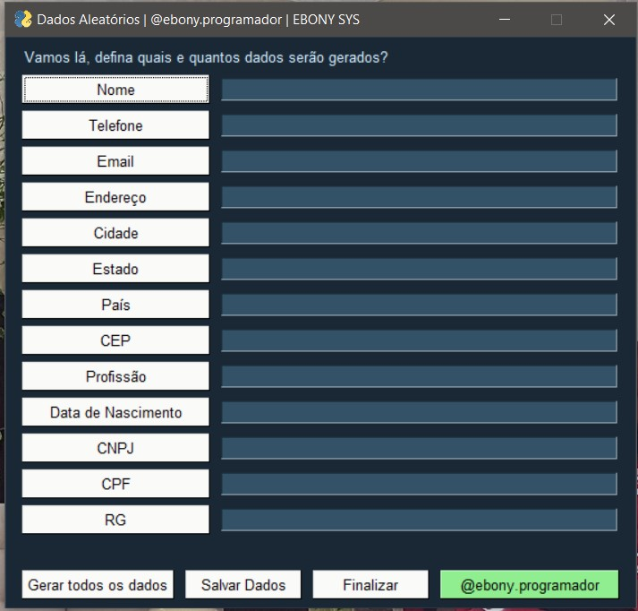

# Diversos mini projetos em Python. 

Acompanhe o desenvolvimento → [Canal códigos simples](https://www.youtube.com/channel/UC8fRZfYGd21_D8DwuEcFuHw)
 ...mais informações → <a href="https://api.whatsapp.com/send?phone=5511979714423">WhatsApp</a>

---

 
    
 Gerador de Dados Aleatórios
    
 <table>
  <tr>
    <td>
      
    </td>
    </td>
    </td>
    <td>
         
    </td>
  </tr>
</table> 

---
