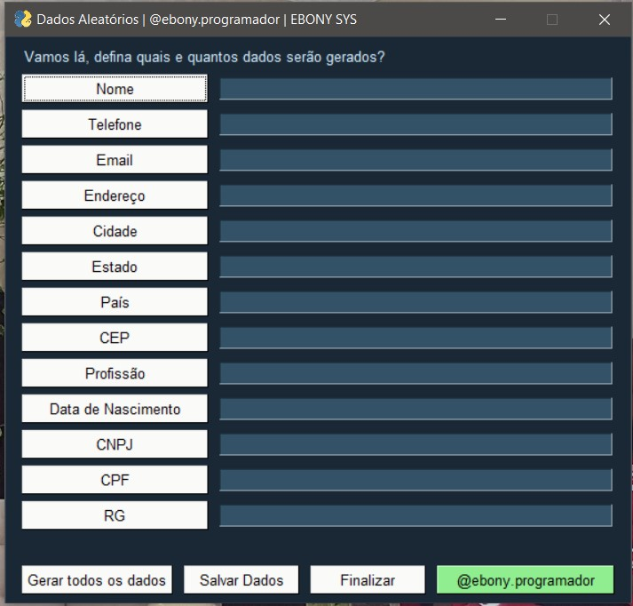

    

        
    
    
    

        
Projetos em Python

    

 

    <strong>Salve!</strong> Neste rep tenho alguns projetos e estudos em Python, pra facilitar
    vou separá-los em projetos prontos/em desenvolvimento. Espero que algum te ajude e não esqueça de deixar aquela ⭐ ;)

    <h3>Projetos prontos!</h3>
    <h5 align="center">Lendo Texto em Áudio.</h5>
    <table>
        <tr>
            <td>
                      
            </td>
            <td>
                
            </td>
        </tr>
    </table>
     <h5 align="center">FakeData (Dados aleatórios)</h5>
    <table>
        <tr>
            <td>
                      
            </td>
            <td>
                      
            </td>
        </tr>
    </table>
     <h5 align="center">Covid19</h5>
    

            
    
 

    <h3>Projetos em desenvolvimento!</h3>
    <a href="https://github.com/Ebony-SYS/Python/tree/main/03_PokeDEX">PokeDEX</a> 
    <a href="https://github.com/Ebony-SYS/Python/tree/main/04_Controle%20de%20Despesas">Controle de Despesas</a> 
    <a href="https://github.com/Ebony-SYS/Python/tree/main/06_ToDo">ToDo (Lista de Tarefas)</a>

Acompanhe o desenvolvimento → [Canal códigos simples](https://www.youtube.com/channel/UC8fRZfYGd21_D8DwuEcFuHw)
 ...mais informações → <a href="https://api.whatsapp.com/send?phone=5511979714423">WhatsApp</a>

